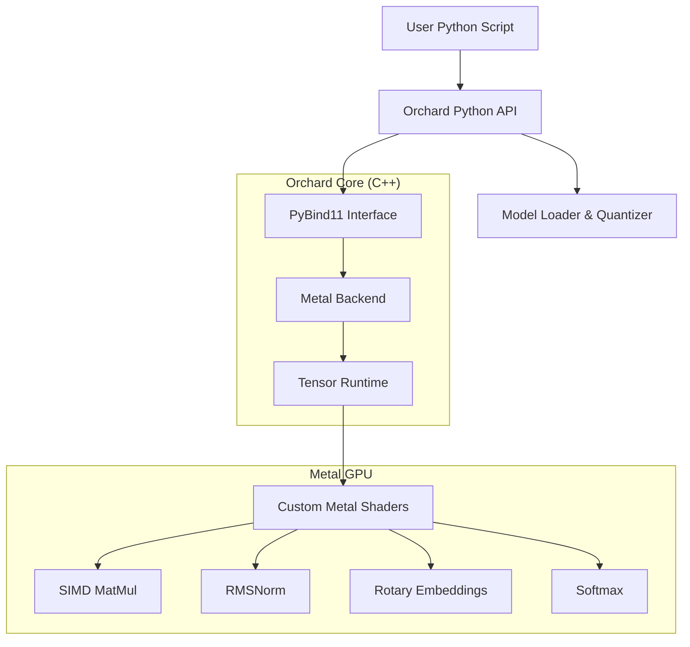

# Orchard

**The High-Performance LLM Runtime for Apple Silicon.**

[](https://opensource.org/licenses/MIT)
[-black.svg)](https://www.apple.com/mac/)
[](https://www.python.org/)
[](https://developer.apple.com/metal/)

Orchard is a specialized inference engine designed to extract maximum performance from Apple Silicon (M1/M2/M3/M4) chips. By bypassing generic frameworks and targeting the Metal API directly, Orchard achieves state-of-the-art speed and efficiency for local Large Language Model (LLM) inference.

> **"The engine is the car."** — Orchard runs models closer to the metal than ever before.

---

## Key Features

*   **Apple Silicon Native**: Built directly on Metal (Objective-C++) for zero-overhead GPU access. No PyTorch, no TensorFlow, just raw compute.
*   **4-bit Quantization**: Custom `INT4` kernels allow running massive models on consumer hardware (e.g., 7B models on 8GB RAM).
*   **Blazing Fast**: Up to **82x faster** than CPU inference for quantized workloads.
*   **Zero-Copy Architecture**: Unified memory architecture is fully exploited—CPU and GPU share memory pointers where possible.
*   **Pythonic Control**: A lightweight, high-level Python API controls the heavy lifting done in C++.

---

## Installation

### Prerequisites
*   **macOS 13.0+** (Ventura or later)
*   **Apple Silicon** (M1/M2/M3/M4)
*   **Python 3.9+**
*   **Xcode Command Line Tools** (`xcode-select --install`)

### Quick Install (From Source)

```bash
# 1. Clone the repository
git clone https://github.com/tarso-bertolini/Orchard.git
cd Orchard

# 2. Create a virtual environment (Recommended)
python3 -m venv .venv
source .venv/bin/activate

# 3. Install
pip install .
```

---

## CLI Usage

Orchard comes with a powerful CLI to manage your local AI environment.

### 1. Check System Compatibility
See what your hardware can handle.
```bash
orchard info
```

### 2. Download Models
Interactive downloader for popular models (Llama-2, Mistral, TinyLlama).
```bash
orchard download
```

### 3. Optimize Models (New!)
Pre-quantize models to 4-bit format for **instant loading** and reduced disk usage.
```bash
orchard optimize --model models/Llama-2-7b-chat --output models/Llama-2-7b-chat-opt
```

### 4. Run Inference
Chat with your model immediately.
```bash
orchard run --model models/Llama-2-7b-chat-opt --prompt "Explain quantum computing like I'm 5."
```

---

## Python API

Integrate Orchard into your own applications with just a few lines of code.

```python
from orchard import Llama

# Load a model (supports Hugging Face format)
# If the model is not optimized, it will be quantized on-the-fly.
model = Llama("models/Llama-2-7b-chat-opt")

# Generate text
print("Generating...")
model.generate(
    prompt="Write a haiku about apples.",
    max_tokens=50,
    temperature=0.7
)
```

---

## Performance Benchmarks

**Device:** Apple M2 (Unified Memory)

| Operation | Implementation | Time | Speedup |
| :--- | :--- | :--- | :--- |
| **Matrix Mul (FP32)** | NumPy (CPU) | 15.15 ms | 1.0x |
| **Matrix Mul (FP32)** | Metal (GPU) | 26.82 ms | 0.6x (Overhead bound) |
| **Llama Layer (INT4)** | NumPy (FP16) | 34.58 ms | 1.0x |
| **Llama Layer (INT4)** | **Orchard (Metal)** | **0.42 ms** | **82.3x** |

*See [BENCHMARKS.md](docs/BENCHMARKS.md) for the full report.*

---

## Architecture

Orchard uses a hybrid execution model to balance flexibility and performance.



### Memory Model
*   **Weights**: Stored in **VRAM** (GPU) as packed INT4 textures.
*   **KV Cache**: Managed in **RAM** (CPU) and streamed to GPU on-demand (Hybrid Strategy for v0.1).
*   **Activations**: Transient GPU buffers.

---

## Roadmap

- [x] **Phase 1: Metal Viability** (Kernels for MatMul, Softmax, RMSNorm)
- [x] **Phase 2: Runtime Core** (C++ Backend, Tensor Abstraction)
- [x] **Phase 3: Packaging** (CLI, PyPI structure, Offline Optimization)
- [ ] **Phase 4: Advanced Features** (Batched Inference, Continuous Batching)
- [ ] **Phase 5: LoRA Support** (Runtime adapter composition)

---

## Contributing

Orchard is an open exploration of high-performance computing on Apple Silicon. Contributions, issues, and PRs are welcome!

1.  Fork the repo.
2.  Create your feature branch (`git checkout -b feature/amazing-feature`).
3.  Commit your changes.
4.  Push to the branch.
5.  Open a Pull Request.

---

## License

MIT License. See [LICENSE](LICENSE) for details.

---

*Built in Cupertino (and beyond).*
