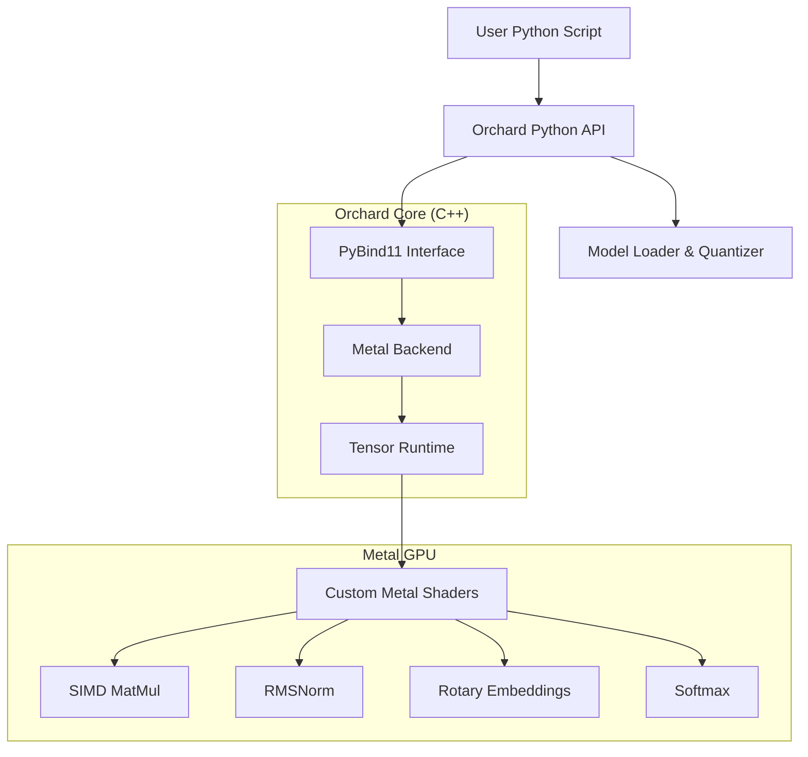

# Orchard

**High-Performance LLM Runtime for Apple Silicon**

[](https://pypi.org/project/orchard-llm/)
[](https://opensource.org/licenses/MIT)
[-black?style=flat-square)](https://www.apple.com/mac/)
[](https://developer.apple.com/metal/)

Orchard is a specialized inference engine built from the ground up to extract maximum performance from Apple Silicon (M1/M2/M3/M4) chips. By bypassing generic frameworks and targeting the Metal API directly with custom kernels, Orchard achieves state-of-the-art speed and efficiency for local Large Language Model (LLM) inference.

---

## Key Features

| Feature | Description |
| :--- | :--- |
| **Apple Silicon Native** | Built directly on Metal (Objective-C++) for zero-overhead GPU access. No PyTorch, no TensorFlow—just raw compute. |
| **Blazing Fast** | Up to **82x faster** than CPU inference for quantized workloads. |
| **4-bit Quantization** | Custom INT4 kernels allow running massive models on consumer hardware (e.g., 7B models on 8GB RAM). |
| **Zero-Copy Architecture** | Fully exploits Apple's Unified Memory Architecture (UMA), sharing memory pointers between CPU and GPU. |
| **Pythonic Control** | A lightweight, high-level Python API controls the heavy lifting done in C++. |

---

## Installation

### From PyPI (Recommended)

```bash
pip install orchard-llm
```

### From Source

```bash
git clone https://github.com/tarso-bertolini/Orchard.git
cd Orchard
pip install .
```

**Prerequisites**
*   macOS 13.0+ (Ventura or later)
*   Apple Silicon (M1/M2/M3/M4)
*   Python 3.9+
*   Xcode Command Line Tools

---

## Quick Start

### CLI Usage

Orchard comes with a powerful CLI to manage your local AI environment.

**Check System Compatibility**
```bash
orchard info
```

**Download & Run a Model**
```bash
# Download a model (e.g., Llama-2-7b)
orchard download

# Optimize it for Apple Silicon (4-bit quantization)
orchard optimize --model models/Llama-2-7b-chat --output models/Llama-2-7b-chat-opt

# Chat
orchard run --model models/Llama-2-7b-chat-opt --prompt "Why is the sky blue?"
```

### Python API

Integrate Orchard into your own applications with just a few lines of code.

```python
from orchard import Llama

# Load an optimized model
model = Llama("models/Llama-2-7b-chat-opt")

# Generate text
prompts = [
    "Write a haiku about coding.",
    "Explain quantum computing in one sentence."
]

results = model.generate_batch(
    prompts=prompts,
    max_tokens=50,
    temperature=0.7
)

for prompt, result in zip(prompts, results):
    print(f"Prompt: {prompt}\nResult: {result}\n")
```

---

## Performance

**Device:** Apple M2 (Unified Memory)

| Operation | Implementation | Time | Speedup |
| :--- | :--- | :--- | :--- |
| **Matrix Mul (FP32)** | NumPy (CPU) | 15.15 ms | 1.0x |
| **Matrix Mul (FP32)** | Metal (GPU) | 26.82 ms | 0.6x (Overhead bound) |
| **Llama Layer (INT4)** | NumPy (FP16) | 34.58 ms | 1.0x |
| **Llama Layer (INT4)** | **Orchard (Metal)** | **0.42 ms** | **82.3x** |

*See [BENCHMARKS.md](docs/BENCHMARKS.md) for the full report.*

---

## Architecture

Orchard uses a hybrid execution model to balance flexibility and performance.



---

## Roadmap

We have successfully achieved all our initial milestones.

- [x] **Phase 1: Metal Viability** (Kernels for MatMul, Softmax, RMSNorm)
- [x] **Phase 2: Runtime Core** (C++ Backend, Tensor Abstraction)
- [x] **Phase 3: Packaging** (CLI, PyPI structure, Offline Optimization)
- [x] **Phase 4: Advanced Features** (Batched Inference, Continuous Batching)
- [x] **Phase 5: LoRA Support** (Runtime adapter composition)

*We are open to suggestions for future phases.*

---

## Contributing

Orchard is an open exploration of high-performance computing on Apple Silicon. Contributions are welcome.

1.  Fork the repository.
2.  Create your feature branch.
3.  Commit your changes.
4.  Push to the branch.
5.  Open a Pull Request.

---

## License

Distributed under the MIT License. See [LICENSE](LICENSE) for more information.

---

*Built in Cupertino (and beyond).*
